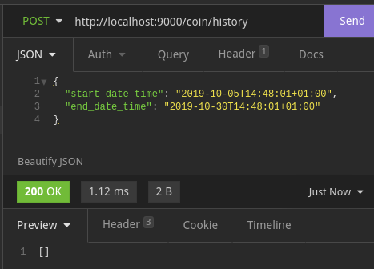

# Bitcoin Simulation - bitsum
Personal Record coin transaction

## Details
1. Code Architecture is using Hexagonal Archtecture.
2. Using HashTable mechanism that allows to break-down distribution of data to Hour level in memory caching.
3. 1 Hash Key or Hour allows to have multiple records.
4. The Balance or the latest transactional data record is a direct access to record.
5. Doesn't allow new transaction that has date behind the latest transaction date or back-date. Because transaction records should have moving forward dates.
6. Doesn't allow to pay bigger amount than the balance.
7. All times are process and store in UTC.
8. Amount does not allow 0 (zero) or less.


## How to Run
```
go run cmd/main.go
```

## APIs
1. `/coin/receive`\
Allows to Increment the amount of balance, update the latest transaction date and append new history data.
example:
```
curl --request POST \
  --url http://localhost:9000/coin/receive \
  --header 'Content-Type: application/json' \
  --data '{
	"datetime": "2019-10-05T14:48:01+01:00",
	"amount": 1000
}'
```


2. `/coin/pay`\
Decrement the amount of balance, update the latest transaction date and append new history data.
example:
```
curl --request POST \
  --url http://localhost:9000/coin/pay \
  --header 'Content-Type: application/json' \
  --data '{
	"datetime": "2019-10-15T15:48:01+01:00",
	"amount": 1.1
}'
```
### success:

### not enough amount:


3. `/coin/history`\
Shows the historical data between start and end dates.
example:
```
curl --request POST \
  --url http://localhost:9000/coin/history \
  --header 'Content-Type: application/json' \
  --data '{
	"start_date_time": "2019-10-05T14:48:01+01:00",
	"end_date_time": "2019-10-30T14:48:01+01:00"
}'
```
### success:

### no data:

### bad date:


4.  `/coin/wallet`\
Shows the balance and the latest transaction date.
example:
```
curl --request GET \
  --url http://localhost:9000/coin/wallet
```
### success:

### no record:
